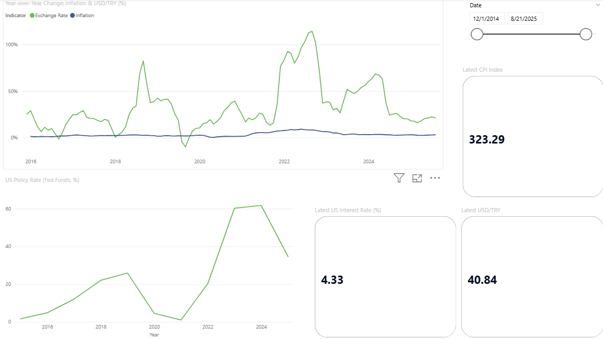
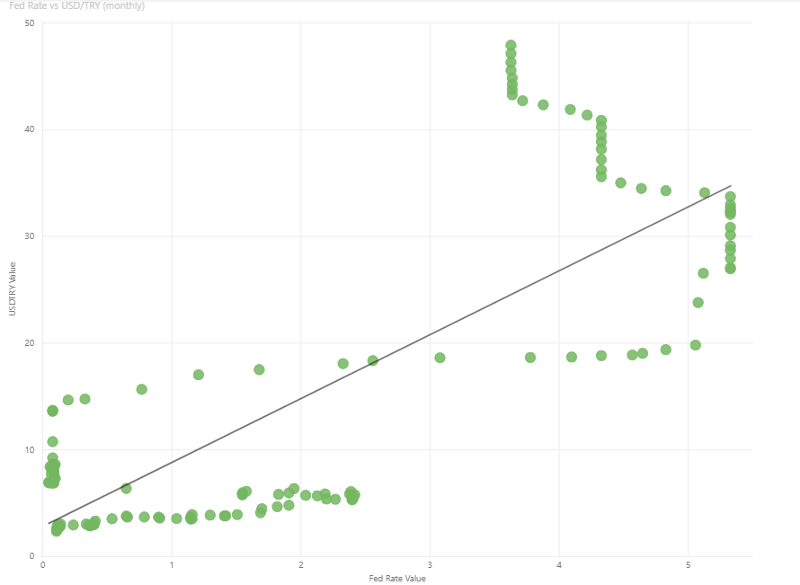

# US Monetary Policy vs USD/TRY — Power BI Dashboard

A Power BI project that pulls macro data from public APIs, cleans it with Python,
and studies how the US Fed interest rate and inflation moved over the past decade,
next to the USD/TRY exchange rate.

The goal was not to make pretty charts, but to ask a real question, collect and
clean the data myself, and end with an honest conclusion.

## Business question

How did US monetary policy (Fed interest rate and inflation) move over the past
decade, and how did USD/TRY behave in the same period? Did the lira move together
with the Fed rate, or not?

## Dashboard preview

<!-- Add your screenshots here. Example:



-->


## What the data shows

- The Fed rate stayed near zero from 2015 to 2021, then rose sharply to about 5%
  in 2022–2023, before easing back to around 3.6%.
- USD/TRY rose the whole time, from about 2.3 to about 48.
- On the scatter plot the points fall into two separate groups. Even while the Fed
  rate was near zero (2015–2021), the lira kept losing value. After 2022 the Fed
  rate jumped and the lira fell much faster.

## Conclusion

There is no clean positive relationship between the Fed rate and USD/TRY. When the
Fed rate barely moved (0–2.5% during 2015–2021), the lira still lost more than half
its value. The two series went up together mostly because both trended upward over
time, not because the Fed rate drives the lira. The lira's fall looks driven mainly
by Turkey's own dynamics (local inflation and monetary policy), with US rate hikes
adding some extra pressure after 2022.

So US monetary policy should be treated as a secondary factor for lira risk, not the
main explanation. This is a good reminder that correlation is not causation: two
lines rising at the same time do not prove that one causes the other.

## Data sources

| Indicator | Source | Series / detail |
|-----------|--------|-----------------|
| US interest rate | FRED (Federal Reserve) | `FEDFUNDS` (Fed Funds Rate, monthly) |
| US inflation | FRED (Federal Reserve) | `CPIAUCSL` (Consumer Price Index, monthly) |
| Exchange rate | Frankfurter API | USD/TRY, daily → averaged to monthly |

## How it was built

1. **Data collection (Python).** A small Python script (`market_data.py`) calls the
   FRED and Frankfurter APIs, cleans each series, and writes one tidy CSV.
   - FRED returns missing values as `.`; these are converted to blanks and dropped.
   - The exchange rate is daily, so it is resampled to a monthly average to line up
     with the monthly FRED data.
   - All three indicators are stored in long format: `date | value | Indicator`.
2. **Modeling (Power BI).** The CSV is loaded, a separate `DimDate` calendar table
   is built, and it is linked to the data table (star schema). A calendar table is
   needed for the time-intelligence measures to work correctly.
3. **Measures (DAX).** `Total Value`, `YoY %`, `Moving Avg 3M`, `Latest Value`, plus
   two helper measures (`Fed Rate Value`, `USDTRY Value`) that pull a single
   indicator out of the long-format table so it can be used on the scatter chart.
4. **Report (3 pages).**
   - **Overview** — KPI cards (latest values) + Fed rate line + year-over-year change.
   - **Correlation** — scatter plot of Fed rate vs USD/TRY.
   - **Insights** — the written question, findings, interpretation and limits.

## Techniques used

- Pulling data from REST APIs (FRED with an API key, Frankfurter without one)
- Data cleaning and reshaping to long format with pandas
- Resampling daily data to monthly to align series
- Star schema modeling with a dedicated date table
- Time-intelligence DAX (`SAMEPERIODLASTYEAR`, `DATESINPERIOD`)
- Filtering a long-format table into single-indicator measures with `CALCULATE`

## Data limitations

- The interest rate and inflation are **US data** (FRED). Only the exchange rate is
  Turkey-specific. The project studies US policy against the lira, not a single
  country's internal picture.
- Correlation is not causation. Two series sharing an upward time trend can look
  related without a real causal link.
- FRED's missing observations were dropped, so the most recent month can be
  incomplete for some indicators.
- YoY % is unreliable for the Fed rate, because it was near zero for years and
  dividing by a near-zero base makes the percentage explode. For that reason the
  Fed rate is shown as a raw level, and YoY % is used only for inflation and the
  exchange rate.

## How to run it yourself

1. Get a free API key from FRED: https://fredaccount.stlouisfed.org/apikeys
2. Install the Python libraries:
   ```
   pip install requests pandas
   ```
3. Open `market_data.py` and paste your key into the `FRED_API_KEY` line.
4. Run it:
   ```
   python market_data.py
   ```
   This creates `market_data.csv`.
5. Open the Power BI file, and if needed point the CSV source to your new file, then
   refresh.

## Files in this repo

- `market_data.py` — the Python script that builds the dataset
- `market_data.csv` — the cleaned dataset (sample output)
- `piyasa_analizi.pbix` — the Power BI report
- `images/` — dashboard screenshots

## A note on the data source

This project pulls from public REST APIs, which is a good way to learn the full flow.
In a real company, Power BI usually connects to a SQL database or a data warehouse
instead of an API, but the steps after that (cleaning, modeling, DAX, visuals) are
the same.
